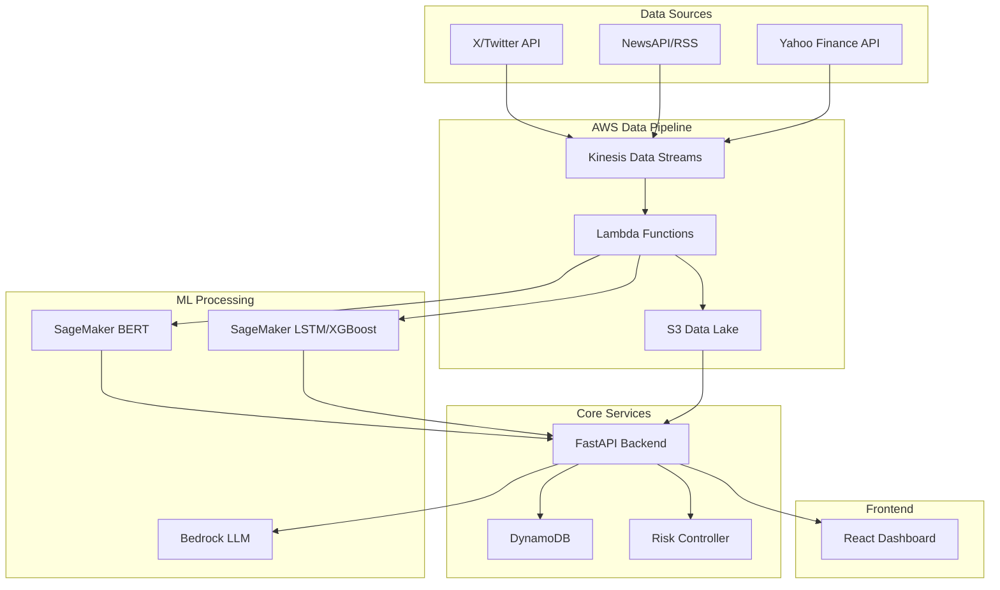

# Design Document

## Overview

The Sentiment-Driven Trading Agent is a cloud-native AI system built on AWS that processes multi-source data streams to make autonomous trading decisions. The architecture follows a microservices pattern with event-driven processing, real-time analytics, and explainable AI components.

## Architecture



## Components and Interfaces

### Data Ingestion Layer

**Kinesis Data Streams**
- Three streams: social-media, financial-news, market-data
- Partition by stock symbol for parallel processing
- 24-hour retention for replay capability

**Lambda Processors**
- `sentiment-processor`: BERT inference on social media posts
- `news-processor`: News relevance scoring and categorization
- `market-processor`: Technical indicator calculations
- Auto-scaling based on stream volume

### ML Processing Layer

**SageMaker Endpoints**
- BERT model for sentiment classification (real-time inference)
- LSTM model for time-series prediction (batch inference)
- XGBoost model for feature-based prediction (batch inference)
- Model versioning and A/B testing capabilities

**AWS Bedrock Integration**
- Claude/GPT models for explanation generation
- Prompt templates for consistent output format
- Context injection with trade signals and market data

### Core Application Layer

**FastAPI Backend Services**
- `/sentiment`: Real-time sentiment aggregation API
- `/predictions`: Price prediction endpoints
- `/trades`: Trading signal generation and execution
- `/explanations`: Trade reasoning and insights
- `/portfolio`: Position management and performance metrics

**DynamoDB Tables**
- `sentiment-scores`: Time-series sentiment data by symbol
- `predictions`: Model outputs with confidence intervals
- `trades`: Executed trades with metadata
- `explanations`: Generated explanations linked to trades
- `portfolio`: Current positions and performance metrics

**Risk Controller Service**
- Position sizing validation
- Portfolio allocation limits (5% per position)
- Stop-loss order management (2% threshold)
- Volatility-based trading halts
- Real-time risk metrics calculation

### Frontend Layer

**React Dashboard Components**
- `SentimentChart`: Real-time sentiment visualization
- `PredictionPanel`: Price forecasts with confidence bands
- `TradeHistory`: Executed trades with explanations
- `PortfolioView`: Current positions and performance
- `RiskMetrics`: Real-time risk monitoring

## Data Models

### Sentiment Data
```typescript
interface SentimentScore {
  symbol: string;
  timestamp: number;
  score: number; // -1 to 1
  confidence: number; // 0 to 1
  volume: number; // post count
  source: 'twitter' | 'reddit';
}
```

### Prediction Data
```typescript
interface PricePrediction {
  symbol: string;
  timestamp: number;
  horizon: '1d' | '3d' | '7d';
  predicted_price: number;
  confidence_lower: number;
  confidence_upper: number;
  model: 'lstm' | 'xgboost';
}
```

### Trade Data
```typescript
interface Trade {
  id: string;
  symbol: string;
  timestamp: number;
  action: 'buy' | 'sell';
  quantity: number;
  price: number;
  signal_strength: number;
  explanation_id: string;
}
```

## Error Handling

### Data Pipeline Resilience
- Dead letter queues for failed Lambda executions
- Exponential backoff retry logic
- Circuit breaker pattern for external API calls
- Data validation at ingestion points

### ML Model Fallbacks
- Model ensemble voting for prediction consensus
- Fallback to historical averages on model failures
- Confidence thresholding to filter low-quality predictions
- Model health monitoring and automatic rollback

### Trading Safety Mechanisms
- Pre-trade validation checks
- Position limit enforcement
- Market hours validation
- Emergency stop functionality

## Testing Strategy

### Unit Testing
- Lambda function logic testing
- Risk controller validation
- Data transformation accuracy
- API endpoint functionality

### Integration Testing
- End-to-end data pipeline validation
- ML model inference testing
- Database consistency checks
- External API integration testing

### Performance Testing
- Load testing for 10,000+ posts/hour
- Latency testing for real-time components
- Stress testing for market volatility scenarios
- Scalability testing for concurrent users

### Simulation Testing
- Monte Carlo backtesting framework
- Historical data replay testing
- Risk scenario simulation
- Strategy performance validation